# Digital Enigma Walkthrough

## Introduction
Hey. We hope you had fun hunting the flag. If you got stuck somewhere, here is a walkthrough to help you out.

## Round 3

1. You get the pdf file for the round and it needs a password which opens with the flag from round 2- `Weeknd`.

2. You look through the pdf and probably get suspicious about the `^` and the `*`. You were right, they spell out a message in morse code. 

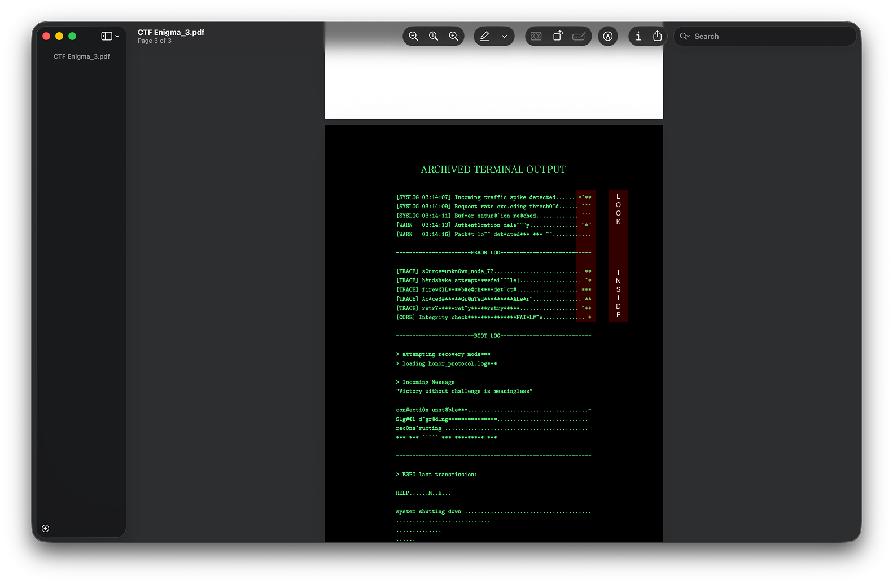

3. The message says 'LOOK INSIDE' - which hints towards looking inside the pdf file and not the content. (Also given as a hint during the round). Looking at the metadata, we find three base64 encoded strings.

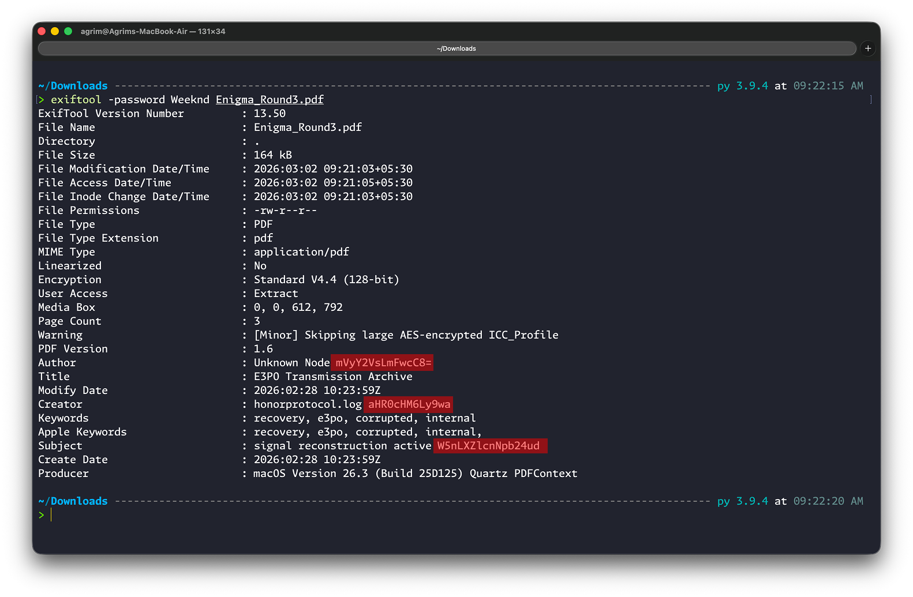

4. Do a bit of trial and error (figure out the first string, since it is the only one that decodes to something readable, then the second and third).

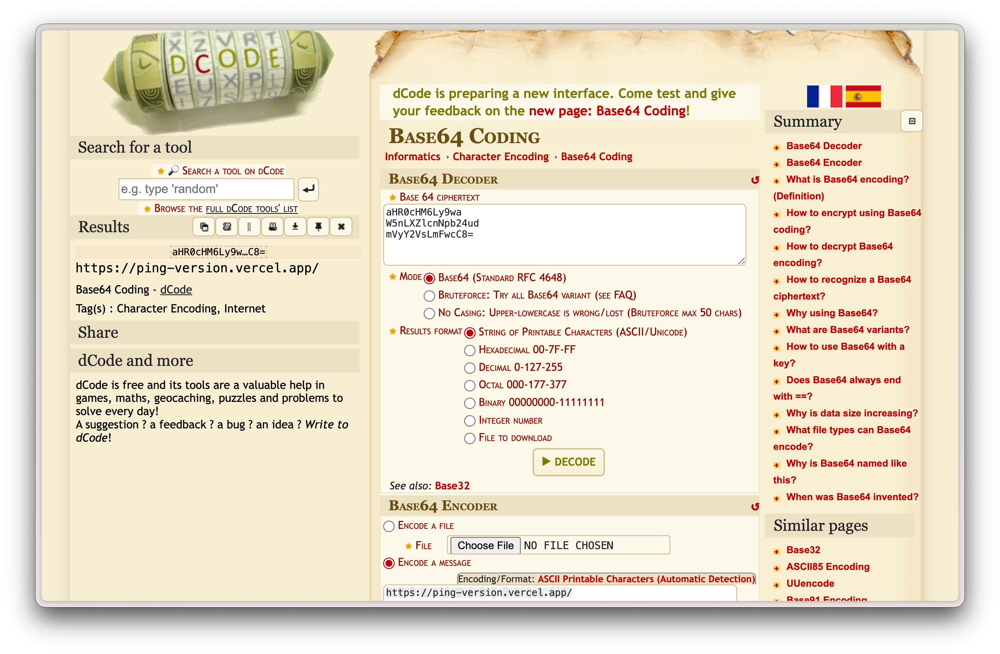

5. This gives you a website link - `https://ping-version.vercel.app/`. Going to the website, you find a mystery solving interactive text based game. Unfortunately, this is a decoy and using the illuminating cursor you have, you find a github logo in the background. 

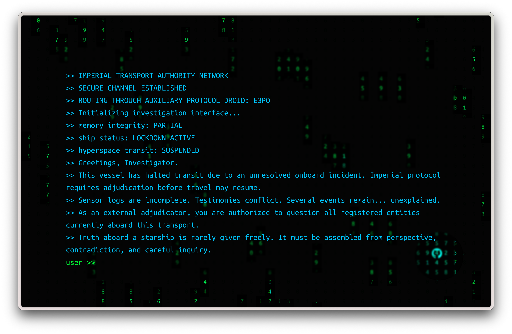

6. Alas, you can't click on it. So, you go to inspect and search for github, finding the element with the link to the github repo as "https://github.com/Agrim-Bansal/en-vcs-ping-repo".

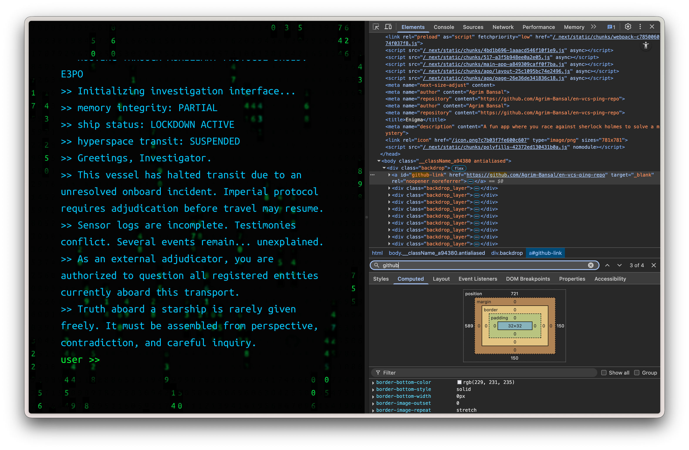

7. Inside of the repository, you see code for the website we were just on but nothing near a password. So we click on the commit history and find a commit with the message "Fix Security Issue" which is super suspicious.

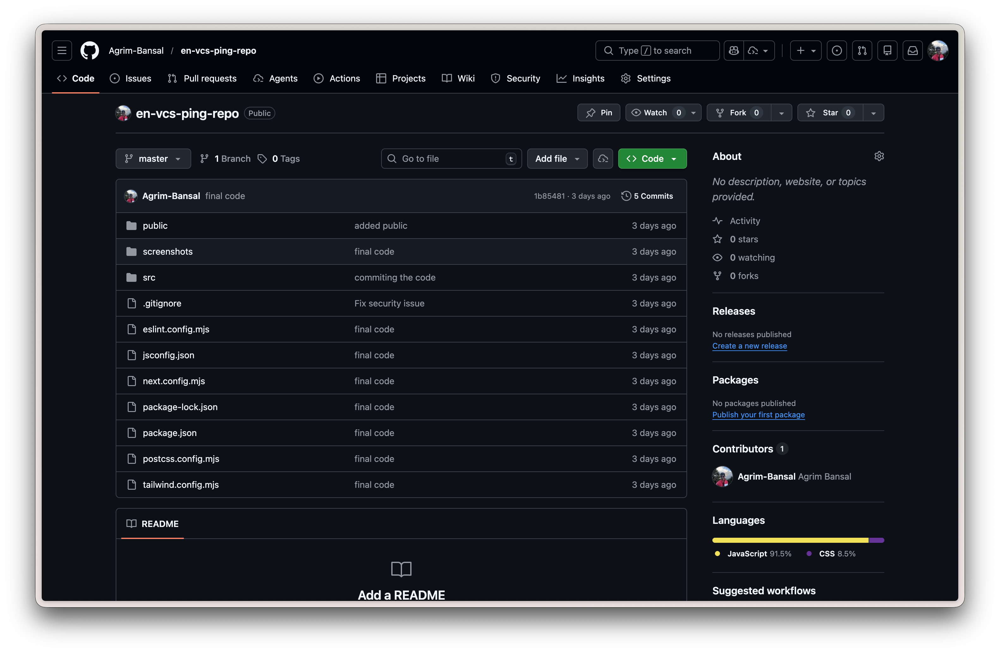
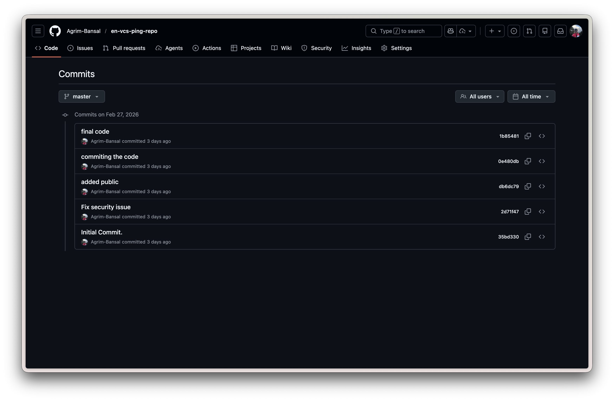

8. Inside of it, we find a .env file with a password - `ALANTURING` which is NOT the flag (as also clarified during the round).

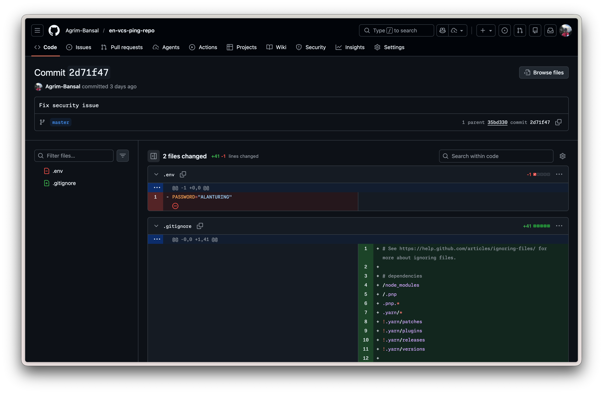

9. So, we go back to the website and re-read the name - `ping-version` and the commit message - "Fix Security Issue" which we found in the commit history (corresponding to version), suggest that ping might mean something. This hints towards opening the network tab in the inspect element. There we see a continuous series of pings to another website - "enigma-book.vercel.app".

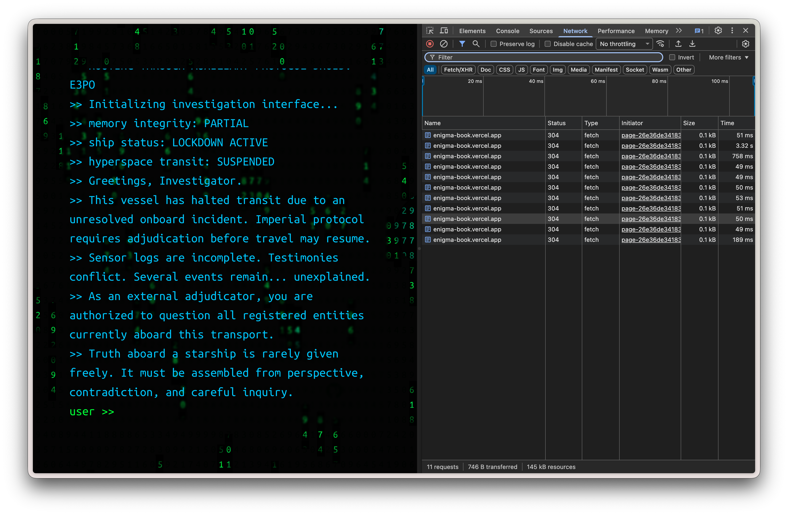

10. Open that website and we see a story (basically a "book" - this will be useful later) which asks for a password at the bottom.

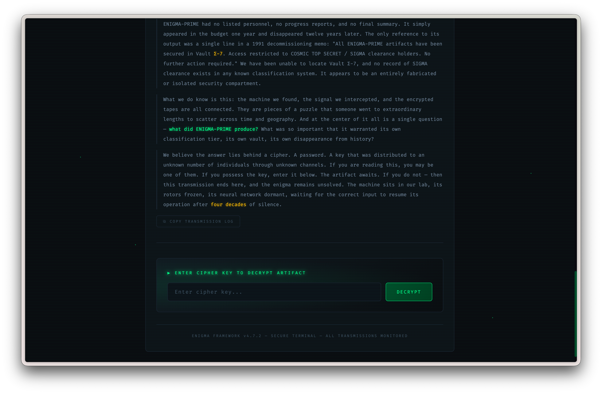

11. We key in the password we found in the github repo - `ALANTURING` and it works! That shows us an image which seems to download upon clicking with some text on its top left corner.

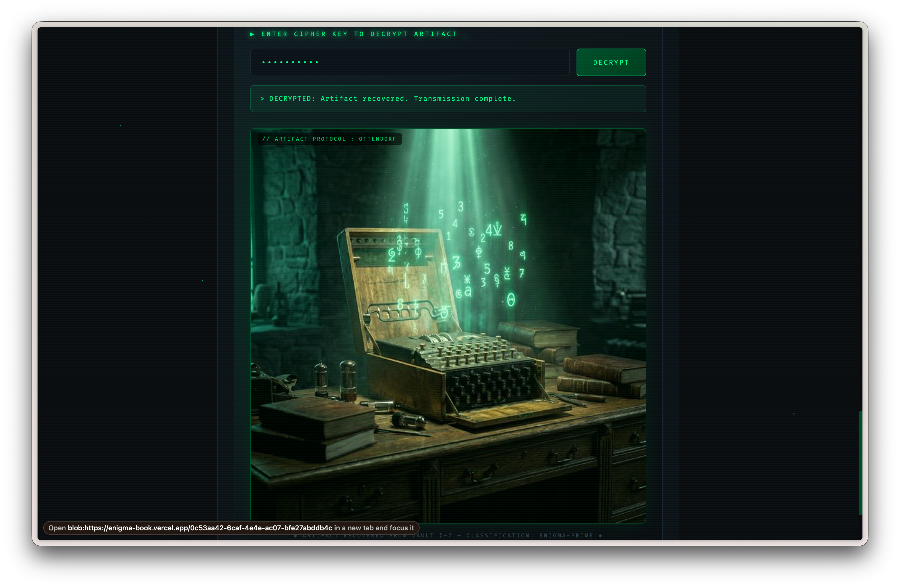

12. This image when seen with meta data, gives "flag={167, 332, 209, 1061, 538, 1071, 634, 380}" but clearly, the message is encoded in some way. (Hint given that the flag is all strings)

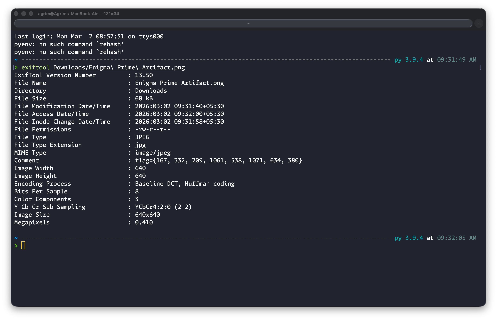

13. So, to decipher the message, you pick up on the clue in the text on the image "Artifact Protocol: Ottendorf". Thus we need to use the Ottendorf cipher to decode the message. Now, we have the message and the cipher but we still need the key. This key (book) is the story on the website - this was clued in by the button to "COPY TRANSMISSION LOG" which copies the story into the clipboard.

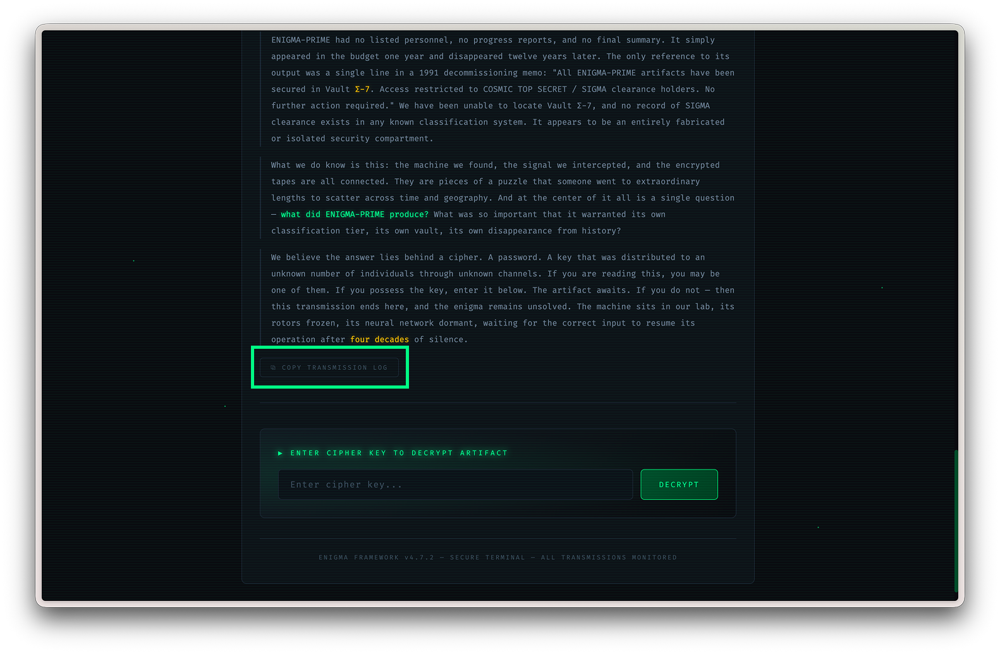

14. Taking that and putting the message and the key into an ottendorf cipher decoder, you finally get the winning flag - `TORVALDS`.

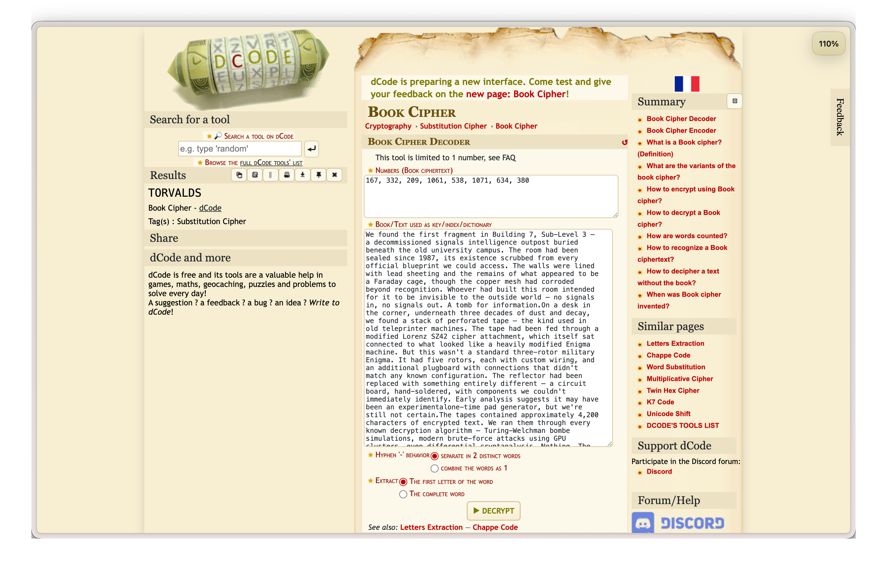

15. Congratulations on making it this far and we hope you had fun solving the puzzle. 

